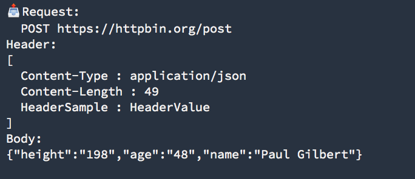
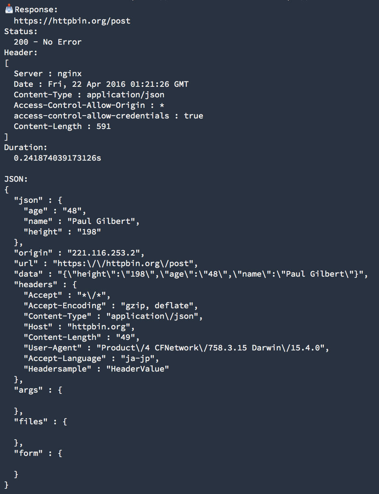

# HTTPLogger
[](https://travis-ci.org/muukii/HTTPLogger) [](http://cocoapods.org/pods/HTTPLogger) [](http://cocoapods.org/pods/HTTPLogger) [](http://cocoapods.org/pods/HTTPLogger)

## About

Logging HTTP Request of NSURLSession.


### Request Log


### Response Log


## Usage (Setup)

- Register NSURLProtocol

```swift
HTTPLogger.register()
```

- Setup NSURLSessionConfiguration

```swift
let configuration = NSURLSessionConfiguration.defaultSessionConfiguration()
HTTPLogger.setup(configuration)

// Sample Alamofire
Alamofire.Manager(configuration: configuration)
```

### Custom

- Create and Set Configuration

```swift
struct Configuration: HTTPLoggerConfigurationType {
  func printLog(string: String) {
    NSLog(string)
  }

  public func enableCapture(request: NSURLRequest) -> Bool {
    #if DEBUG
      return true
    #else
      return false
    #endif
  }
}
```

```swift
HTTPLogger.configuration = Configuration()
```

## Installation
HTTPLogger is available through [CocoaPods](http://cocoapods.org). To install it, simply add the following line to your Podfile:

```ruby
pod "HTTPLogger"
```

## Author
muukii, m@muukii.me

## License
HTTPLogger is available under the MIT license. See the LICENSE file for more info.
